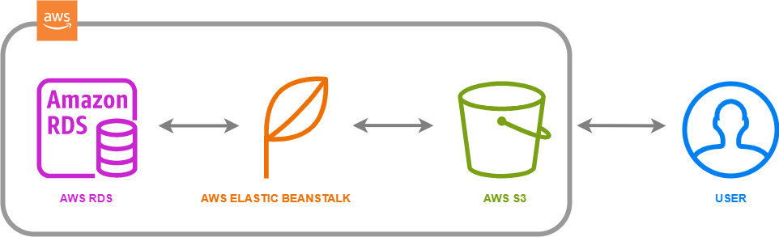

# Infrastructure description

## AWS

### DATABASE
    PostgreSQLL database is hosted on AWS RDS:
        - DB identifier: udagram-db
        - endpoint: udagram-db.cyfsaxslc7ke.us-east-1.rds.amazonaws.com

### API
    Backend is hosted on AWS Elastic Beanstalk:
        - APP: udagram-api
        - ENV: udagram-api-dev
        - DOMAIN: udagram-api-dev.us-east-1.elasticbeanstalk.com 

### FRONTEND
    Frontend is hosted on AWS S3:
        - BUCKET: bucket-482921242854
        - BUCKET WEBSITE ENDPOINT: http://bucket-482921242854.s3-website-us-east-1.amazonaws.com 

### Infrastructure Schema

