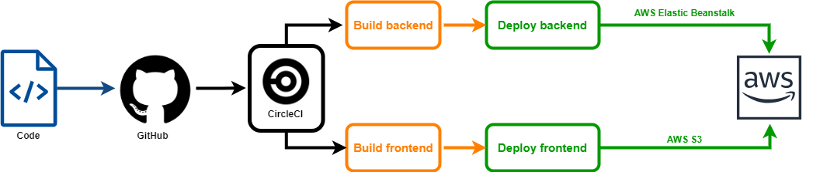

# Project pipeline

### Pipeline diagram

#### Github

    First of all we need to commit and push our code to GitHub repo. When code is pushed, CIrcleCi is triggered and start jobs.

#### CircleCI

CircleCi read  `.circleci/config.yml` file and start jobs which are defined in that file.

 

Workflow:

Install all frontend dependencies 
`npm run frontend:install`

Install all backend dependencies
`npm run api:install`

Build frontend
`npm run frontend:build`

Build backend
`npm run api:build`

Deploy frontend and backend
`npm run deploy`   